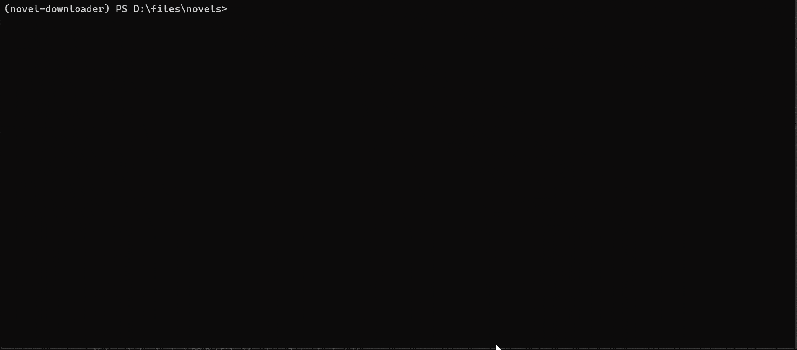

## CLI 使用示例

支持的站点列表详见: [站点支持文档](./4-supported-sites.md)

### 目录

- [CLI 使用示例](#cli-使用示例)
  - [目录](#目录)
  - [快速开始](#快速开始)
  - [登录/鉴权](#登录鉴权)
  - [全局用法与帮助](#全局用法与帮助)
  - [子命令总览](#子命令总览)
    - [1. download 子命令](#1-download-子命令)
    - [2. search 子命令](#2-search-子命令)
    - [3. export 子命令](#3-export-子命令)
    - [4. config 子命令](#4-config-子命令)
    - [5. clean 子命令](#5-clean-子命令)
    - [5.1 clean state 子命令](#51-clean-state-子命令)
    - [5.2 clean logs 子命令](#52-clean-logs-子命令)
    - [5.3 clean cache 子命令](#53-clean-cache-子命令)
    - [5.4 clean book 子命令](#54-clean-book-子命令)
  - [附录 A: 术语与约定](#附录-a-术语与约定)

### 快速开始

```bash
# 根据 URL 下载书籍
novel-cli download https://www.hetushu.com/book/5763/index.html

# 指定站点下载 (例如 b520)
novel-cli download --site b520 8_8187

# 导出为 EPUB
novel-cli export --format epub 88888
```

---

### 登录/鉴权

当配置启用 `login_required: true` 时, CLI 会检测登录状态; 若未登录, 将提示在命令行输入当前站点的有效 Cookie 或账号信息。

---

### 全局用法与帮助

```text
novel-cli COMMAND [ARGS]...

Options:
  --help    显示此帮助信息并退出
```

> 所有子命令均支持 `--help` 查看对应帮助文本。

---

### 子命令总览

```text
Commands:
  download    下载小说
  search      搜索小说
  export      导出已下载的小说
  config      管理配置与语言
  clean       清理缓存与配置
```

---

#### 1. download 子命令

下载完整小说, 支持三种方式:

1. **直接传入 URL**
2. **指定站点 + 书籍 ID**
3. **省略参数, 从配置文件读取 ID**

**Synopsis**

```bash
novel-cli download [-h] [--site SITE] [--config CONFIG] [--start START] [--end END] [--no-export] [book_ids | url]
```

**Options**

* `book_ids | url`:
  * 输入书籍 ID (配合 `--site` 使用)
  * 输入书籍/章节 URL (自动解析站点与书籍 ID)
  * 省略时将从配置文件读取 `book_ids`
* `--site SITE`: 站点键 (如 `qidian`, `b520`, ...), 若直接传入 URL, 可省略
* `--start START`: 起始章节**唯一 ID** (仅用于第一个 `book_id`)
* `--end`: 结束章节**唯一 ID**, **包含** (仅用于第一个 `book_id`)
* `--no-export`: 仅下载, 不进行导出。启用后将跳过导出步骤

> `--start` / `--end` 用于临时下载部分章节, 仅影响**第一个**命令行提供的 `book_id`。
>
> `--start` 和 `--end` 接收**章节唯一 ID**, 并非 "第几章" 的序号。可参考 [`supported-sites.md`](./4-supported-sites.md) 内说明。
>
> 需要复杂范围/忽略章节等, 请在配置文件使用结构化 `book_ids`; 参见 [配置文件说明](./3-settings-schema.md)。

**Examples**


```bash
# 方式一: 直接通过 URL 启动下载
novel-cli download https://www.hetushu.com/book/5763/index.html

# 方式二: 指定站点 + 书籍 ID
novel-cli download --site b520 8_8187
novel-cli download --site n23qb 12282
novel-cli download --site qidian 1010868264

# 只下载部分章节
novel-cli download --site qidian 1010868264 --start 402902546 --end 406807540

# 仅下载, 跳过导出步骤
novel-cli download --no-export --site qidian 1010868264

# 方式三: 从配置文件中读取 ID
novel-cli download --site n23qb
```

---

#### 2. search 子命令

按关键字搜索小说

**Synopsis**

```bash
novel-cli search [-h] [--site SITE] [--config CONFIG] [--limit N] [--site-limit M] keyword
```

**Options**

* `keyword`: 搜索关键字
* `--site SITE`, `-s SITE`: 指定搜索站点, 可多次使用以指定多个站点, 不指定则搜索全部支持站点
* `--limit N`: 总体结果上限 (最小 1), 默认为 `200`
* `--site-limit M`: 单站点结果上限 (最小 1), 默认为 `10`

**Examples**



```bash
# 搜索所有站点 (默认全部)
novel-cli search 三体

# 指定单个站点 (如 b520)
novel-cli search --site b520 三体

# 搜索 b520, 返回最多 5 条结果
novel-cli search --site b520 --limit 5 三体

# 总体返回最多 20 条, 每站点最多 5 条
novel-cli search --limit 20 --site-limit 5 三体

# 指定多个站点 (b520 和 n23qb)
novel-cli search -s b520 -s n23qb 三体
```

---

#### 3. export 子命令

导出已下载的小说为指定格式

**Synopsis**

```bash
novel-cli export [-h] [--format FORMAT] [--site SITE] [--config CONFIG] [book_id ...]
```

**Options**

* `book_ids`: 要导出的一个或多个书籍 ID (可选; 若省略则会交互式选择)
* `--format FORMAT`: 导出格式: `txt` / `epub`, 默认使用配置文件设定
* `--site SITE`: 站点键 (如 `b520`, `qidian`, ...), (可选; 若省略则会交互式选择)
* `--config CONFIG`: 指定配置文件路径 (可选)
* `--start`: 起始章节 ID, 仅应用于第一本书
* `--end`: 结束章节 ID, 仅应用于第一本书

**Examples**


```bash
# 指定导出格式为 EPUB
novel-cli export --format epub

# 指定站点来源并导出多本书
novel-cli export --site b520 12345 23456

# 省略 site 和 book_ids, 进入交互模式选择站点和书籍
novel-cli export
```

> 提示: 未指定 `--site` 或 `book_id` 时, 将进入交互模式, 从已有下载的站点和书籍中进行选择。

---

#### 4. config 子命令

初始化和管理下载器设置, 包括切换语言等

**Synopsis**

```bash
novel-cli config COMMAND [ARGS]...
```

**Subcommands**

* `init [--force]`: 在当前目录初始化默认配置文件 (`./settings.toml`); `--force` 覆盖已存在文件
* `set-lang LANG`: 切换 CLI 语言 (`zh_CN` / `en_US`)

**Examples**

```bash
# 切换界面语言为英文
novel-cli config set-lang en_US

# 初始化默认配置到当前目录
novel-cli config init

# 强制覆盖已存在的配置文件
novel-cli config init --force
```

---

#### 5. clean 子命令

用于清理应用运行过程中产生的**内部状态 / 日志 / 站点缓存 / 书籍原始数据**。

清理后, 下次运行会自动重新生成对应资源 (如重新抓取 metadata / 章节 / 媒体等)。

`clean` 包含 4 个子命令:

* `state`: 清理内部状态文件 (运行时状态、临时信息)
* `logs`: 清理应用日志文件
* `cache`: 清理站点级缓存 (字体/共享资源等, 按站点目录划分)
* `book`: 清理书籍原始缓存数据 (章节 SQLite / metadata / media / 或整书目录)

**Synopsis**

```bash
novel-cli clean [-h] {state,logs,cache,book} ...
```

**Examples**

```bash
# 查看 clean 总帮助
novel-cli clean --help
```

---

#### 5.1 clean state 子命令

清理内部状态文件 (例如运行时记录、临时信息)

**Synopsis**

```bash
novel-cli clean state [-h] [-y]
```

**Options**

* `-y, --yes`: 跳过确认提示, 直接执行

**Examples**

```bash
# 清理内部状态
novel-cli clean state

# 强制清理 (跳过确认)
novel-cli clean state --yes
```

---

#### 5.2 clean logs 子命令

清理应用生成的日志文件。

**Synopsis**

```bash
novel-cli clean logs [-h] [--config CONFIG] [-y] [--dry-run]
```

**Options**

* `--config CONFIG`: 配置文件路径
* `-y, --yes`: 跳过确认提示
* `--dry-run`: 仅显示将被删除的日志文件, 不实际删除

**Examples**

```bash
# 试运行: 查看将要删除的日志文件
novel-cli clean logs --dry-run

# 清理日志
novel-cli clean logs

# 强制清理日志 (跳过确认)
novel-cli clean logs -y

# 指定配置文件位置
novel-cli clean logs --config ./settings.toml
```

---

#### 5.3 clean cache 子命令

清理站点级缓存目录, 缓存目录结构为:

```
<cache_dir>/<site_key>/
```

例如站点共享字体或解析缓存等。

**Synopsis**

```bash
novel-cli clean cache [-h] [--config CONFIG] [--site SITE] [-y]
```

**Options**

* `--config CONFIG`: 配置文件路径
* `--site SITE`: 站点键值 (如 `qidian`, `b520`), 省略时清理全部站点缓存
* `-y, --yes`: 跳过确认提示

**Examples**

```bash
# 清理指定站点缓存
novel-cli clean cache --site qidian

# 清理全部站点缓存 (删除整个 cache_dir)
novel-cli clean cache

# 跳过确认提示
novel-cli clean cache --site b520 -y

# 指定配置文件
novel-cli clean cache --config ./settings.toml
```

---

#### 5.4 clean book 子命令

清理一本或多本书的原始缓存数据, 数据目录结构为:

```
<raw_data_dir>/<site_key>/<book_id>/
```

默认会删除章节 SQLite 数据 (可按 `--start/--end` 限定范围)

可按需指定是否删除 media 或整书目录。

**Synopsis**

```bash
novel-cli clean book [-h]
    [--site SITE] [--config CONFIG]
    [--start START] [--end END]
    [--stage STAGE]
    [--no-chapters] [--metadata] [--media] [--all]
    [-y]
    [book_ids ...]
```

**Options**

* `book_ids`: 一个或多个书籍 ID
* `--site SITE`: 站点键值
* `--config CONFIG`: 配置文件路径
* `--start START`: 起始章节 ID (仅对第一本书生效)
* `--end END`: 结束章节 ID (仅对第一本书生效, **包含 end**)
* `--stage STAGE`: 清理阶段 (如 `raw`, `cleaned`), 默认 `raw`
* `--no-chapters`: 不删除章节数据 (SQLite 不动)
* `--metadata`: 删除 metadata JSON
* `--media`: 删除媒体资源目录 (图片等)
* `--all`: 删除该书**全部原始数据目录** (忽略其他清理选项), 若同时省略 `book_ids`, 则清理指定站点/全部站点的整站 raw_data
* `-y, --yes`: 跳过确认提示

**Examples**

```bash
# 默认清理
novel-cli clean book --site qidian 1010868264

# 清理指定范围章节 (仅第一本书生效)
novel-cli clean book --site qidian 1010868264 --start 402902546 --end 406807540

# 只清理 metadata, 不清章节
novel-cli clean book --site qidian 1010868264 --no-chapters --metadata

# 清理 media (图片等)
novel-cli clean book --site qidian 1010868264 --media

# 删除整本书所有原始数据 (直接删目录)
novel-cli clean book --site qidian 1010868264 --all

# 删除指定站点全部 raw_data (省略 book_ids 且 --all)
novel-cli clean book --site qidian --all

# 删除全部站点 raw_data (省略 site 且 --all)
novel-cli clean book --all

# 跳过确认提示
novel-cli clean book --site qidian 1010868264 --all -y
```

> 提示: `--start/--end` 接收**章节唯一 ID**, 并非 "第几章" 的序号

---

### 附录 A: 术语与约定

* **SITE (站点键)**: 在命令中用于指明站点的短名称 (如 `qidian`, `b520`, `n23qb`) 。完整列表见 [站点支持文档](./4-supported-sites.md)。
* **章节唯一 ID**: 站点侧用于标识章节的 ID, **不是**连续的 "第 N 章" 序号; 在 `--start`/`--end` 中应传入此 ID。
* **配置文件路径**: 若未显式传入 `--config`, CLI 会按「配置优先级」自动解析。
