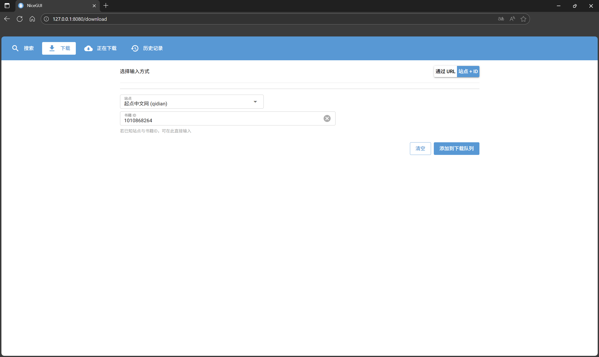

## WEB 使用示例

支持的站点列表详见: [站点支持文档](./4-supported-sites.md)

### 目录

- [WEB 使用示例](#web-使用示例)
  - [目录](#目录)
  - [快速开始](#快速开始)
    - [任务执行规则](#任务执行规则)
    - [页面路由一览](#页面路由一览)
  - [search 搜索页面](#search-搜索页面)
  - [download 下载页面](#download-下载页面)
    - [模式一: Via URL](#模式一-via-url)
    - [模式二: Site + ID](#模式二-site--id)
  - [progress 当前下载进度](#progress-当前下载进度)
  - [history 历史记录](#history-历史记录)

### 快速开始

```bash
# 启动 Web 界面 (基于当前 settings.toml)
novel-web

# 如需提供局域网/外网访问 (请自行留意安全与网络环境)
# novel-web --listen public
```

#### 任务执行规则

* **不同站点的任务**: 会**并行下载**，互不阻塞。
* **相同站点的任务**: 会**顺序排队执行**，避免与站点接口冲突。
* **全局没有并发限制**: 一次性添加太多任务可能导致 **带宽/CPU/内存** 被耗尽，或触发站点的反爬机制。建议合理**分批添加任务**，避免资源耗尽。

---

#### 页面路由一览

| 页面            | 路由         | 作用                                    |
| --------------- | ----------- | --------------------------------------- |
| 搜索 (search)   | `/`         | 搜索小说并一键加入下载队列                 |
| 下载 (download) | `/download` | 通过“URL”或“站点+ID”添加下载任务          |
| 进度 (progress) | `/progress` | 查看运行中/排队中的任务与实时进度，支持取消 |
| 历史 (history)  | `/history`  | 浏览并下载历史导出的文件 (txt/epub)       |

---

### search 搜索页面


**用途**: 在多个站点中搜索小说，支持结果流式刷新、排序、分页，并可直接把条目加入下载队列。

**使用说明**

1. 在顶部输入框中键入关键词，点击「搜索」或按下 `Enter` 开始搜索。
2. 结果会**逐步出现**，无需等待全部结束即可浏览与操作。
3. 每条结果展示: 封面 (若无则占位)、标题 (可新标签打开原站详情)、等书籍信息。
4. 点击条目右侧的「下载」即可将该书加入下载队列。
5. 点击「Stop」可中断当前搜索。

**筛选与高级设置 (Settings)**

* **站点选择**: 支持「全选 / 清空」以及按站点勾选检索范围。
* **Per-site Limit** (默认 `30`): 限制每个站点最多返回的结果数。
* **Timeout (seconds)** (默认 `10.0`): 单站点检索超时时间。

**排序与分页**

* 排序字段: `Priority` (默认)、`Site`、`Title`、`Author`；顺序支持 `Ascending / Descending`。
* 分页: 每页 `20` 条。
* **快捷键**: `←` / `→` 切换上一页 / 下一页 (在列表区域时)。

**状态提示**

* 顶部状态条会显示「Searching...」与「当前已获取 N 条结果」等信息。

---

### download 下载页面

可在两种模式间切换: **Via URL** 与 **Site + ID**。

#### 模式一: Via URL


**使用说明**

1. 将**小说详情页链接**粘贴到「Novel URL」。
2. 失焦 (或稍等) 后将自动**解析站点与书籍 ID**，并在「解析结果」中展示。
3. 点击「添加到下载列表」即可添加任务。
4. 解析失败会给出提示 (可能是链接不受支持或无效)。

> 提示: 在任意输入框按 `Enter` 也会提交; 「Clear」可快速清空重填。

#### 模式二: Site + ID



**使用说明**

1. 在「站点」下拉中选择站点 (默认 `qidian`)。
2. 在「Book ID」中输入对应站点的书籍 ID。
3. 点击「添加到下载列表」即可添加任务。

---

### progress 当前下载进度


**用途**: 一处查看所有任务的生命周期与实时进度，必要时可取消任务或在完成后直接下载导出文件。

**页面结构**

* **Running / Queued**: 正在下载或排队中的任务
  * 显示站点、书籍 ID、进度条与已完成章节数。
  * 支持「Cancel」取消运行中/排队中的任务。
* **Completed / Cancelled / Failed**: 历史结束任务
  * 对已完成任务，若生成 `txt/epub` 等文件，会直接显示**下载按钮** (点击即可下载该次导出的文件)。

**刷新频率**: 页面会**每 0.5 秒自动刷新**一次状态。

---

### history 历史记录


**用途**: 浏览与下载本地历史导出文件，目前支持 `txt` 与 `epub`。

**数据来源**

* 文件来自配置项 `general.output_dir` (默认 `./downloads`)。

**功能点**

* **类型过滤**: `All / txt / epub`。
* **排序**: 按文件名 (Filename) 或修改时间 (Modified Time); 支持升序/降序。
* **分页**: 每页 `20` 个文件，底部提供分页器。
* **手动刷新**: 点击「Refresh」重新扫描目录。
* **下载**: 每个文件卡片上提供「下载」按钮，点击即下发文件。

**快捷键**

* 在列表区域使用 `←` / `→` 切换上一页 / 下一页。
