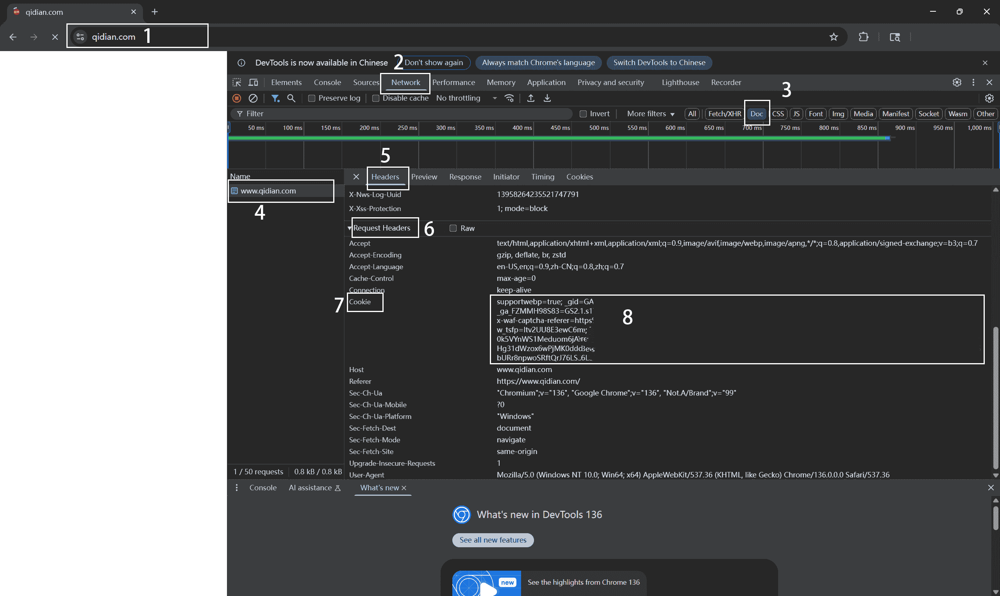

## 复制 Cookies



1. 在浏览器中输入目标网址, 打开需要提取 Cookies 的页面
   - 打开开发者工具
   - 可按 `F12` 键, 或通过右键点击页面空白处并选择 "检查" (Inspect)
2. 切换至 `Network` (网络) 标签
3. 在工具栏中点击 `Doc`, 以便过滤出文档类请求
4. 找到与当前网页地址相符的请求项并点击它
   - 如果没有找到, 请在开发者工具打开的状态下刷新页面 (`F5` 或 `Ctrl + R`), 然后重新检查
5. 切换到右侧的 `Headers` (请求标头) 面板
6. 向下滚动, 找到 `Request Headers` 区块
7. 找到 `Cookie` 一项
8. 复制其右侧显示的完整内容

---

或:

1. 打开浏览器, 登录 [https://www.qidian.com](https://www.qidian.com)
2. 按 `F12` 打开开发者工具
3. 切到「Console」控制台
4. 粘贴下面这行代码并回车:
    ```js
    copy(document.cookie)
    ```
