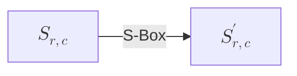

# ADVANCED ENCRYPTION STANDARD (AES) 学习笔记

日期: 2025/08/01

Reference:

- [Different ways/algorithms for implementing AES](https://crypto.stackexchange.com/questions/44672/different-ways-algorithms-for-implementing-aes)
- [Federal Information Processing Standards (FIPS) Publication 197](https://nvlpubs.nist.gov/nistpubs/FIPS/NIST.FIPS.197.pdf)

---

## 引言

高级加密标准 (Advanced Encryption Standard, AES) 是一种对称分组加密算法 (symmetric block-cipher algorithm)，由美国国家标准与技术研究院 (NIST) 在 FIPS 197 标准中正式定义与发布。

AES 基于 Rijndael 密码 (Rijndael cipher)，该算法以 128 位 (bits) 的数据分组进行运算，并支持 `128`、`192` 或 `256` 位的密钥长度 (key size)。

虽然 Rijndael 算法本身可灵活配置其他分组大小与密钥长度，但 AES 标准化版本仅采用这三种 "口味" -- 通常称为 `AES-128`、`AES-192` 和 `AES-256`。

## 定义

### 术语与缩略语表

| 术语                              | 定义                                                                               |
| --------------------------------- | --------------------------------------------------------------------------------- |
| `AES`                             | 高级加密标准 (Advanced Encryption Standard)                                        |
| `仿射变换` (Affine Transformation) | 一种变换，由矩阵乘法后接向量加法组成。                                               |
| `数组` (Array)                    | 一组按顺序排列的相同实体 (例如：字节数组)。                                           |
| `位` (Bit)                        | 取值为 0 或 1 的二进制数字。                                                        |
| `分组` (Block)                    | 构成输入、输出、状态 (State) 和轮密钥 (Round Key) 的二进制位序列。序列的长度即其包含的位数。分组也可解释为字节数组。 |
| `字节` (Byte)                     | 由 8 位组成的集合，可作为单个实体或 8 个独立位的数组处理。                             |
| `密码` (Cipher)                   | 一系列将明文 (Plaintext) 转换为密文 (Ciphertext) 的变换，使用密码密钥 (Cipher Key)。   |
| `密码密钥` (Cipher Key)           | 由密钥扩展 (Key Expansion) 过程生成一组轮密钥 (Round Keys) 所用的秘密加密密钥；通常表示为一个 4x`Nk` 的字节数组。 |
| `密文` (Ciphertext)               | 从密码 (Cipher) 输出或作为逆密码 (Inverse Cipher) 输入的数据。                        |
| `逆密码` (Inverse Cipher)         | 一系列将密文转换为明文的变换，使用密码密钥 (Cipher Key)。                              |
| `密钥扩展` (Key Expansion)        | 从密码密钥生成一系列轮密钥的过程。                                                     |
| `明文` (Plaintext)                | 输入到密码或从逆密码输出的数据。                                                      |
| `Rijndael`                        | 本高级加密标准 (AES) 中指定的加密算法。                                               |
| `轮密钥` (Round Key)              | 由密码密钥通过密钥扩展生成的值；在密码和逆密码中应用于状态 (State)。                     |
| `状态` (State)                    | 中间加密结果，通常表示为一个 4x`Nb` 的字节数组。                                       |
| `S 盒` (S-box)                    | 在字节替代 (byte-substitution) 变换以及密钥扩展过程中使用的非线性替代表。               |
| `字` (Word)                       | 由 32 位组成的集合，可作为单个实体或 4 个字节的数组处理。                               |

### 算法参数、符号和函数

| 符号              | 描述                                                                                                |
| ----------------- | -------------------------------------------------------------------------------------------------- |
| `AddRoundKey()`   | 在密码和逆密码中，将轮密钥 (Round Key) 通过异或 (XOR) 运算添加到状态 (State) 的变换。(轮密钥长度 = 状态大小: 当 `Nb` = 4 时为 128 位 / 16 字节) |
| `InvMixColumns()` | 逆密码中的变换，是 `MixColumns()` 的逆运算。                                                          |
| `InvShiftRows()`  | 逆密码中的变换，是 `ShiftRows()` 的逆运算。                                                           |
| `InvSubBytes()`   | 逆密码中的变换，是 `SubBytes()` 的逆运算。                                                            |
| `K`               | 密码密钥 (Cipher Key)。                                                                             |
| `MixColumns()`    | 密码中的变换，将状态 (State) 的所有列分别混合以生成新的列，列与列之间互不影响。                           |
| `Nb`              | 构成状态的列数 (32-bit words)。在标准中，`Nb` = 4。                                                 |
| `Nk`              | 构成密码密钥的 32 位字数。在标准中，`Nk` = 4、6 或 8。                                               |
| `Nr`              | 轮数 (number of rounds)，是 `Nk` 和 `Nb` 的函数。在标准中，`Nr` = 10、12 或 14。                     |
| `Rcon[]`          | 在密钥扩展中使用的轮常数字数组 (Round constant word array)。                                           |
| `RotWord()`       | 密钥扩展函数，对一个四字节 (four-byte) 字进行循环移位 (cyclic permutation)。                            |
| `ShiftRows()`     | 密码中的变换，将状态的最后三行按不同偏移量循环移位。                                                     |
| `SubBytes()`      | 密码中的变换，对状态中每个字节独立应用 S 盒 (S-box)。                                                   |
| `SubWord()`       | 密钥扩展函数，对四字节字的每个字节应用 S 盒 (S-box)。                                                   |
| `XOR`             | 异或 (Exclusive-OR) 运算。                                                                           |
| $\oplus$          | 另一种表示异或 (Exclusive-OR) 运算的符号。                                                            |
| $\otimes$         | 多项式乘法 (degree < 4) 模 $x^4 + 1$。                                                              |
| $\cdot$           | 有限域乘法 (finite-field multiplication)。                                                            |

## 符号与约定

### 输入与输出

AES 算法的输入与输出均由一个 128 位 (bits) 的二进制序列组成（每个位的取值为 0 或 1）。这些序列有时称为**分组** (blocks)，其所包含的位数被称为**长度** (length)。AES 的**密码密钥** (Cipher Key) 是一个长度为 128、192 或 256 位的序列，标准不允许使用其他输入、输出或密钥长度。


在这些序列中，位的编号从 0 开始，直到序列长度减 1（即分组长度或密钥长度减 1）。附加在位上的数字 $i$ 被称为该位的**索引** (index)，其取值范围因分组长度或密钥长度不同而有所区别：
$0 \leq i < 128$、$0 \leq i < 192$ 或 $0 \leq i < 256$。

### 字节 (Bytes)

AES 算法的基本处理单元是**字节** (byte)，即由 8 个比特组成并作为整体处理的序列。第 3.1 节中描述的输入、输出与密钥位序列，均以**字节数组** (byte array) 的形式处理。这些字节数组是通过将二进制序列按顺序划分为连续的 8 位分组而得到的。

对于一个用符号 `a` 表示的输入、输出或密码密钥，字节数组中的每个字节可以用两种方式引用：$a_n$ 或 `a[n]`，其中 $n$ 的取值范围为：

* 密钥长度 = 128 位，$0 \leq n < 16$；分组长度 = 128 位，$0 \leq n < 16$；
* 密钥长度 = 192 位，$0 \leq n < 24$；
* 密钥长度 = 256 位，$0 \leq n < 32$。

在 AES 中，所有字节值均以花括号包裹的形式表示：$\{b_7, b_6, b_5, b_4, b_3, b_2, b_1, b_0\}$，其中 $b_i \in \{0, 1\}$，并按从高位到低位排列。字节也可解释为**有限域元素** (finite field elements)，其**多项式表示** (polynomial representation) 为：

$$
b_7 x^7 + b_6 x^6 + b_5 x^5 + b_4 x^4 + b_3 x^3 + b_2 x^2 + b_1 x^1 + b_0 = \sum_{i=0}^{7} b_{i} x^{i}
$$

例如，$\{01100011\}$ 表示有限域元素 $x^6 + x^5 + x + 1$。

为了简化表示，也可以使用**十六进制表示法** (hexadecimal notation)，即每 4 个比特为一组，由一个十六进制字符表示，如下表所示。

| 位模式 (Bit Pattern) | 字符 (Character) |
| ----------- | --------- |
| `0000`      | `0`       |
| `0001`      | `1`       |
| `0010`      | `2`       |
| `0011`      | `3`       |
| `0100`      | `4`       |
| `0101`      | `5`       |
| `0110`      | `6`       |
| `0111`      | `7`       |
| `1000`      | `8`       |
| `1001`      | `9`       |
| `1010`      | `a`       |
| `1011`      | `b`       |
| `1100`      | `c`       |
| `1101`      | `d`       |
| `1110`      | `e`       |
| `1111`      | `f`       |

**图 1.** 位模式的十六进制表示 (Hexadecimal representation of bit patterns)

因此，元素 $\{01100011\}$ 可以简写为 $\{63\}$，其中左侧字符对应字节的高位 4 位。

在某些有限域运算中，可能会涉及一个附加位 ($b_8$)，位于 8 位字节的左侧。当存在该额外位时，其会以单独的字节 $\{01\}$ 放在该字节之前。例如，一个 9 位的序列可表示为 $\{01\}\{1b\}$。

### 字节数组 (Arrays of Bytes)

在 AES 中，**字节数组** (array of bytes) 按以下形式表示：

$$
a_{0} \; a_{1} \; a_{2} \; \dots \; a_{15}
$$

这些字节的排列顺序及字节内的位顺序，源自一个 128 位输入序列 (128-bit input sequence)：

$$
input_{0} \; input_{1} \; input_{2} \; \dots \; input_{126} \; input_{127}
$$

对应关系为：

$$
\begin{aligned}
a_{0} &= \{ input_{0}, \; input_{1}, \dots, \; input_{7} \}; \\
a_{0} &= \{ input_{8}, \; input_{9}, \dots, \; input_{15} \}; \\
\vdots \\
a_{15} &= \{ input_{120}, \; input_{121}, \dots, \; input_{127} \}; \\
\end{aligned}
$$

这一模式可推广至更长的输入序列（例如 192 位和 256 位密钥）。一般情况下：

$$
a_{n} = \{ input_{8n}, \; input_{8n+1}, \dots, \; input_{8n+7} \}
$$

结合第 3.2 节与第 3.3 节，图 2 展示了字节与位的编号方式。

| 输入位序列 (Input bit sequence) | 字节编号 (Byte number) | 字节内位编号 (Bit numbers in bytes) |
| ------------------ | ----------- | -------------------- |
| `0`                | `0`         | `7`                  |
| `1`                |             | `6`                  |
| `2`                |             | `5`                  |
| `3`                |             | `4`                  |
| `4`                |             | `3`                  |
| `5`                |             | `2`                  |
| `6`                |             | `1`                  |
| `7`                |             | `0`                  |
| `8`                | `1`         | `7`                  |
| `9`                |             | `6`                  |
| `10`               |             | `5`                  |
| `11`               |             | `4`                  |
| `12`               |             | `3`                  |
| `13`               |             | `2`                  |
| `14`               |             | `1`                  |
| `15`               |             | `0`                  |
| `16`               | `2`         | `7`                  |
| `17`               |             | `6`                  |
| `18`               |             | `5`                  |
| `19`               |             | `4`                  |
| `20`               |             | `3`                  |
| `21`               |             | `2`                  |
| `22`               |             | `1`                  |
| `23`               |             | `0`                  |
| $\cdots$           | $\cdots$    | $\cdots$             |

**图 2.** 字节与位的索引 (Indices for bytes and bits)

### 状态 (The State)

AES 的核心运算在一个称为**状态** (State) 的二维字节数组上进行。该状态由 4 行字节构成，每行包含 $Nb$ 个字节，其中：

$$
Nb = \frac{\text{block length}}{32}
$$

在标准 AES 中，分组长度为 128 位，因此 $Nb = 4$。

若用符号 $s$ 表示状态数组，则其每个字节由两个索引唯一定位：
* 行索引 $r$：$0 \leq r < 4$
* 列索引 $c$：$0 \leq c < Nb$

因此，状态中的单个字节可表示为 $s_{r,c}$ 或 `s[r,c]`。

在**密码** (Cipher) 和**逆密码** (Inverse Cipher) 的初始阶段，输入字节数组 $in_{0}, in_{1}, \dots, in_{15}$ 会按列优先顺序填入状态数组，如图 3 所示。加解密运算完成后，状态数组中的数据再以相同规则输出到字节数组 $out_{0}, out_{1}, \dots, out_{15}$。

<div style="display: flex; justify-content: space-around; align-items: center; gap: 20px;">

  <!-- Input Bytes -->
  <div>
    <p><strong>Input Bytes</strong></p>
    <table border="1">
      <tr><td>in₀</td><td>in₄</td><td>in₈</td><td>in₁₂</td></tr>
      <tr><td>in₁</td><td>in₅</td><td>in₉</td><td>in₁₃</td></tr>
      <tr><td>in₂</td><td>in₆</td><td>in₁₀</td><td>in₁₄</td></tr>
      <tr><td>in₃</td><td>in₇</td><td>in₁₁</td><td>in₁₅</td></tr>
    </table>
  </div>

  <!-- Arrow -->
  <div style="font-size: 24px;">&#8594;</div>

  <!-- State Array Table -->
  <div>
    <p><strong>State Array</strong></p>
    <table>
      <tr><td>S₀,₀</td><td>S₀,₁</td><td>S₀,₂</td><td>S₀,₃</td></tr>
      <tr><td>S₁,₀</td><td>S₁,₁</td><td>S₁,₂</td><td>S₁,₃</td></tr>
      <tr><td>S₂,₀</td><td>S₂,₁</td><td>S₂,₂</td><td>S₂,₃</td></tr>
      <tr><td>S₃,₀</td><td>S₃,₁</td><td>S₃,₂</td><td>S₃,₃</td></tr>
    </table>
  </div>

  <!-- Arrow -->
  <div style="font-size: 24px;">&#8594;</div>

  <!-- Output Bytes Table -->
  <div>
    <p><strong>Output Bytes</strong></p>
    <table>
      <tr><td>out₀</td><td>out₄</td><td>out₈</td><td>out₁₂</td></tr>
      <tr><td>out₁</td><td>out₅</td><td>out₉</td><td>out₁₃</td></tr>
      <tr><td>out₂</td><td>out₆</td><td>out₁₀</td><td>out₁₄</td></tr>
      <tr><td>out₃</td><td>out₇</td><td>out₁₁</td><td>out₁₅</td></tr>
    </table>
  </div>

</div>

**图 3.** 状态数组输入与输出 (State array input and output)

在加密或解密开始阶段：

$$
s[r, c] = in[r + 4c] \quad \quad \text{for $0 \leq r < 4$ and $0 \leq c < Nb$}
$$

在运算结束阶段：

$$
out[r + 4c] = s[r, c] \quad \quad \text{for $0 \leq r < 4$ and $0 \leq c < Nb$}
$$

### 作为列数组的状态 (The State as an Array of Columns)

在 AES 中，**状态数组** (State array) 的每一列由 4 个字节组成，这 4 个字节按列顺序排列，构成一个 32 位字 (32-bit word)。
在该 32 位字中，行索引 $r$（$0 \leq r < 4$）用于标识字内的各个字节位置，而列索引 $c$（$0 \leq c < Nb$）则用来标识该列在整个状态中的位置。

这样，状态数组可以被重新解释为一个由 $Nb$ 个 32 位字构成的一维数组：

$$
\{ w_{0}, \; w_{1}, \; \dots, \; w_{Nb-1} \}
$$

其中，$w_c$ 表示状态数组中第 $c$ 列的所有字节，按照从上到下（行 0 到行 3）的顺序拼接而成。

**例如**，对于图 3 中的标准 AES 情况（$Nb = 4$），状态可等价表示为：

$$
\begin{aligned}
w_{0} &= S_{0, 0} \; S_{1, 0} \; S_{2, 0} \; S_{3, 0} \\
w_{1} &= S_{0, 1} \; S_{1, 1} \; S_{2, 1} \; S_{3, 1} \\
w_{2} &= S_{0, 2} \; S_{1, 2} \; S_{2, 2} \; S_{3, 2} \\
w_{3} &= S_{0, 3} \; S_{1, 3} \; S_{2, 3} \; S_{3, 3}
\end{aligned}
$$

在这种表示方式下，许多 AES 变换（例如 **列混合** (MixColumns) 和 **轮密钥加** (AddRoundKey)）可以直接作用于这些 32 位字，从而简化描述与实现。

## 数学预备知识

在 AES 算法中，所有字节均按照第 3.2 节所述的方法，解释为**有限域元素** (finite field elements)，并在有限域 $\mathrm{GF}(2^8)$ 上进行运算。有限域中的加法与乘法规则与普通整数运算不同。本节介绍实现第 5 节所需的基本数学概念。

### 加法 (Addition)

在 $\mathrm{GF}(2^8)$ 中，加法是通过多项式表示中对应系数的**模 2 加法**实现的。换言之，加法运算等价于逐位的**异或运算** (XOR operation, 记作 $\oplus$)：

$$
1 \oplus 1 = 0,\quad
1 \oplus 0 = 1,\quad
0 \oplus 0 = 0
$$

因此：
* **加法** 与 **减法** 在有限域中是相同的运算。
* 字节加法可理解为对应位的模 2 加法。

对于字节 $\{a_{7}a_{6}a_{5}a_{4}a_{3}a_{2}a_{1}a_{0}\}$ 与 $\{b_{7}b_{6}b_{5}b_{4}b_{3}b_{2}b_{1}b_{0}\}$，其和 $\{c_{7}c_{6}c_{5}c_{4}c_{3}c_{2}c_{1}c_{0}\}$ 满足：

$$
c_i = a_i \oplus b_i \quad (0 \leq i \leq 7)
$$

例如，下列三种表示方式等价：

$$
\begin{aligned}
(x^6 + x^4 + x^2 + x + 1) + (x^7 + x + 1) = x^7 + x^6 + x^4 + x^2 &\quad\quad\text{(polynomial notation)} \\
\{01010111\} \oplus \{10000011\} = \{11010100\} &\quad\quad\text{(binary notation)} \\
\{57\} \oplus \{83\} = \{d4\} &\quad\quad\text{(hexadecimal notation)} \\
\end{aligned}
$$

### 乘法 (Multiplication)

在多项式表示中，$\mathrm{GF}(2^8)$ 中的乘法（记作 $\cdot$）指二进制多项式的乘法，然后对一个**不可约多项式** (irreducible polynomial) 取模。AES 选用的不可约多项式为：

$$
m(x) = x^8 + x^4 + x^3 + x + 1
\tag{4.1}
$$

其十六进制形式为 $\{01\}\{1b\}$。

**示例：**

计算 $\{57\} \cdot \{83\}$：

1. 多项式展开：

$$
(x^6 + x^4 + x^2 + x + 1)(x^7 + x + 1)
= x^{13} + x^{11} + x^9 + x^8 + x^7 + x^6 + x^5 + x^4 + x^3 + 1
$$

2. 对 $m(x)$ 取模：

$$
x^{13} + x^{11} + x^9 + x^8 + x^7 + x^6 + x^5 + x^4 + x^3 + 1
\;\bmod\;(x^8 + x^4 + x^3 + x + 1)
= x^7 + x^6 + 1
$$

3. 转换为字节：
$$
\{57\} \cdot \{83\} = \{c1\}
$$

> 对 $m(x)$ 取模保证结果是次数小于 8 的二进制多项式，因此可以用一个字节表示。与加法不同，字节层面没有直接的按位规则实现乘法。

该乘法满足**结合律** (associative law)，且 $\{01\}$ 为**乘法单位元** (multiplicative identity)。

### 乘法逆元 (Multiplicative Inverse)

对于次数小于 8 的非零二进制多项式 $b(x)$，其乘法逆元 $b^{-1}(x)$ 可通过**扩展欧几里得算法** (extended Euclidean algorithm) 求得：

找到多项式 $a(x)$ 与 $c(x)$ 使得：

$$
b(x)\,a(x) + m(x)\,c(x) = 1
\tag{4.2}
$$

因此：

$$
a(x)\,\cdot\,b(x)\;\bmod\;m(x) = 1
$$

这意味着：

$$
b^{-1}(x) = a(x) \bmod m(x)
\tag{4.3}
$$

### 分配律 (Distributive Law)

有限域运算 (任意 $a(x), b(x), c(x)$) 满足：

$$
a(x)\,\cdot\,(b(x) + c(x)) = a(x)\,\cdot\,b(x) + a(x)\,\cdot\,c(x)
$$

这意味着以 $\oplus$ 作为加法、上述定义的乘法作为乘法，256 个可能的字节值形成有限域 $\mathrm{GF}(2^8)$。

#### 乘以 $x$ (Multiplication by $x$)

若 $b(x)$ 按式 (3.1) 定义，则：

$$
x \cdot b(x) = b_7x^8 + b_6x^7 + b_5x^6 + b_4x^5 + b_3x^4 + b_2x^3 + b_1x^2 + b_0x
\tag{4.4}
$$

根据 (4.1) 定义的 $m(x)$：
* 若 $b_7 = 0$，结果已是次数小于 8 的多项式。
* 若 $b_7 = 1$，需减去（即异或）$m(x)$ 进行约简。

在字节层面，这相当于：
1. 左移一位 (left shift)；
2. 若原最高位 $b_7 = 1$，则与 $\{1b\}$ 异或。

该运算记作 `xtime()`。

乘以 $x$ 的高次幂可以通过多次应用 `xtime()` 来实现。通过对中间结果进行加法，还可以实现乘以任意常数的运算。

**扩展示例：**

计算 $\{57\} \cdot \{13\}$

1. 逐次倍增：

$$
\begin{aligned}
\{57\} \cdot \{02\} &= xtime(\{57\}) = \{ae\} \\
\{57\} \cdot \{04\} &= xtime(\{ae\}) = \{47\} \\
\{57\} \cdot \{08\} &= xtime(\{47\}) = \{8e\} \\
\{57\} \cdot \{10\} &= xtime(\{8e\}) = \{07\} \\
\end{aligned}
$$

2. 按二进制拆解 $\{13\} = \{01\} \oplus \{02\} \oplus \{10\}$：

$$
\begin{aligned}
\{57\} \cdot \{13\} &= \{57\} \cdot (\{01\} \oplus \{02\} \oplus \{10\}) \\
&= \{57\} \oplus \{ae\} \oplus \{07\} \\
&= \{fe\}
\end{aligned}
$$

### 系数属于 $\mathrm{GF}(2^8)$ 的多项式 (Polynomials with Coefficients in $\mathrm{GF}(2^8)$)

在 AES 中，还需要处理一种特殊的**四项多项式** (four-term polynomial)，其系数本身是有限域 $\mathrm{GF}(2^8)$ 的元素（即字节 bytes）：

$$
a(x) = a_3 x^3 + a_2 x^2 + a_1 x + a_0
\tag{4.5}
$$

为了便于表示，这种多项式可写作一个**字** (word)：

$$
[a_0, a_1, a_2, a_3]
$$

> 注意：
> 这种多项式与定义有限域元素时的多项式不同，尽管它们都使用相同的不定元 $x$:
>
> - 在有限域定义中，多项式的系数是 **位** (bits)，并使用不可约多项式 $m(x) = x^8 + x^4 + x^3 + x + 1$ 进行约简。
> - 在本节中，多项式的系数是 **字节** (bytes)，并使用不同的约简多项式 $x^4 + 1$。
>
> 两者需通过上下文加以区分。

### 多项式加法 (Addition)

设：

$$
b(x) = b_3 x^3 + b_2 x^2 + b_1 x + b_0
\tag{4.6}
$$

加法运算是对相同幂次项的系数做有限域加法，即字节级的异或运算 (XOR)。这意味着对整个字进行异或即可完成加法。

根据 (4.5) 和 (4.6)：

$$
a(x) + b(x) = (a_3 \oplus b_3)x^3 + (a_2 \oplus b_2)x^2 + (a_1 \oplus b_1)x + (a_0 \oplus b_0)
\tag{4.7}
$$

### 多项式乘法 (Multiplication)

多项式乘法分为两步：

#### 1. 多项式展开

先直接相乘并收集同类项：

$$
c(x) = c_6 x^6 + c_5 x^5 + c_4 x^4 + c_3 x^3 + c_2 x^2 + c_1 x + c_0
\tag{4.8}
$$

其中系数计算为：

$$
\begin{aligned}
c_0 &= a_0\cdot b_0, \\
c_1 &= a_1\cdot b_0 \;\oplus\; a_0\cdot b_1, \\
c_2 &= a_2\cdot b_0 \;\oplus\; a_1\cdot b_1 \;\oplus\; a_0\cdot b_2, \\
c_3 &= a_3\cdot b_0 \;\oplus\; a_2\cdot b_1 \;\oplus\; a_1\cdot b_2 \;\oplus\; a_0\cdot b_3, \\
c_4 &= a_3\cdot b_1 \;\oplus\; a_2\cdot b_2 \;\oplus\; a_1\cdot b_3, \\
c_5 &= a_3\cdot b_2 \;\oplus\; a_2\cdot b_3, \\
c_6 &= a_3\cdot b_3
\end{aligned}
\tag{4.9}
$$

#### 2. 模 $x^4 + 1$ 约简

由于 AES 中使用的四项多项式次数不超过 3，需要对 $c(x)$ 按 $x^4 + 1$ 取模：

$$
x^i \bmod (x^4 + 1) = x^{\,i \bmod 4}
\tag{4.10}
$$

最终得到模乘积 (modular product)：

$$
d(x) = d_3 x^3 + d_2 x^2 + d_1 x + d_0
\tag{4.11}
$$

其中：

$$
\begin{aligned}
d_0 &= (a_0\cdot b_0) \;\oplus\; (a_3\cdot b_1) \;\oplus\; (a_2\cdot b_2) \;\oplus\; (a_1\cdot b_3), \\
d_1 &= (a_1\cdot b_0) \;\oplus\; (a_0\cdot b_1) \;\oplus\; (a_3\cdot b_2) \;\oplus\; (a_2\cdot b_3), \\
d_2 &= (a_2\cdot b_0) \;\oplus\; (a_1\cdot b_1) \;\oplus\; (a_0\cdot b_2) \;\oplus\; (a_3\cdot b_3), \\
d_3 &= (a_3\cdot b_0) \;\oplus\; (a_2\cdot b_1) \;\oplus\; (a_1\cdot b_2) \;\oplus\; (a_0\cdot b_3)
\end{aligned}
\tag{4.12}
$$

### 矩阵表示 (Matrix Representation)

当 $a(x)$ 固定时，式 (4.11) 的运算可用矩阵乘法表示为：

$$
\begin{bmatrix}
d_0 \\ d_1 \\ d_2 \\ d_3
\end{bmatrix}
=
\begin{bmatrix}
a_0 & a_3 & a_2 & a_1 \\
a_1 & a_0 & a_3 & a_2 \\
a_2 & a_1 & a_0 & a_3 \\
a_3 & a_2 & a_1 & a_0
\end{bmatrix}
\begin{bmatrix}b_0 \\ b_1 \\ b_2 \\ b_3\end{bmatrix}
\tag{4.13}
$$

### AES 中使用的特殊多项式

1. **列混合** (MixColumns) 使用的固定多项式：

$$
a(x) = \{03\}x^3 + \{01\}x^2 + \{01\}x + \{02\}
\tag{4.14}
$$

其逆多项式为：

$$
a^{-1}(x) = \{0b\}x^3 + \{0d\}x^2 + \{09\}x + \{0e\}
\tag{4.15}
$$

2. **轮密钥扩展** (Key Expansion) 中 `RotWord()` 使用的多项式：

$$
a_0 = a_1 = a_2 = \{00\}, \quad a_3 = \{01\} \quad \Rightarrow \quad a(x) = x^3
$$

> 由 (4.13) 可见，该多项式的作用是将字节循环左移，即：

$$
[b_0, b_1, b_2, b_3] \mapsto [b_1, b_2, b_3, b_0]
$$

## 算法规范 (Algorithm Specification)

在 AES 算法中，**输入分组** (input block)、**输出分组** (output block) 与**状态** (State) 的长度固定为 **128 位**。

用 $Nb = 4$ 表示状态中 32 位字 (32-bit words) 的数量，即**列的数量**。

AES 的**密码密钥** (Cipher Key) $K$ 可以是 **128 位、192 位或 256 位**。

用 $Nk = 4, 6, 8$ 表示密钥中 32 位字的数量（同样是列的数量）。

**轮数** (rounds) $Nr$ 取决于密钥长度:

- $Nk = 4$ (AES-128) $\Rightarrow Nr = 10$
- $Nk = 6$ (AES-192) $\Rightarrow Nr = 12$
- $Nk = 8$ (AES-256) $\Rightarrow Nr = 14$

符合标准的**密钥–分组–轮数** (Key–Block–Round) 组合如下表所示（见图 4）。

有关密钥长度、分组大小与轮数的实现细节，参见第 6.3 节。

|                       | 密钥长度 ($Nk$ 字)  | 分组大小 ($Nb$ 字)  | 轮数 ($Nr$) |
|-----------------------|---------------------|---------------------|--------------|
| **AES-128**           | 4                   | 4                   | 10           |
| **AES-192**           | 6                   | 4                   | 12           |
| **AES-256**           | 8                   | 4                   | 14           |

**图 4.** 密钥-分组-轮数组合 (Key-Block-Round Combinations)

### 轮函数 (Round Function)

AES 的加密 (Cipher) 与解密 (Inverse Cipher) 过程，均基于一系列轮 (round) 的迭代运算。

每一轮由以下四个**面向字节的变换** (byte-oriented transformations) 组成：

1. **字节代换** (SubBytes)
   使用替代表 (S-box) 对状态中的每个字节进行非线性代换。

2. **行移位** (ShiftRows)
   将状态数组中每一行的字节，按不同行号循环左移不同的偏移量。

3. **列混合** (MixColumns)
   将状态数组中每列视为 $\mathrm{GF}(2^8)$ 上的多项式，并与固定多项式相乘，实现列内数据的混合。

4. **轮密钥加** (AddRoundKey)
   将当前状态与本轮的轮密钥逐字节异或。

### 密码 (Cipher)

**流程概述：**

1. 输入数据按 **Sec. 3.4** 的规则复制到 **状态数组** (State) 中。
2. 执行一次 **初始轮密钥加** (Initial Round Key Addition)。
3. 状态经过 $Nr$ 轮变换：
   - $Nr = 10$（AES-128）
   - $Nr = 12$（AES-192）
   - $Nr = 14$（AES-256）
   - 前 $Nr - 1$ 轮流程完全相同；最后一轮略有不同（省略 `MixColumns()`）。
4. 最终状态按 **Sec. 3.4** 规则复制到输出。

**参数化方式：**

轮函数由 **密钥编排** (Key Schedule) 参数化。

密钥编排是一个一维四字节数组，通过 **Sec. 5.2** 的 **密钥扩展** (Key Expansion) 生成。

在伪代码（见图 5）中，`w[]` 表示密钥编排数组。

> 所有 $Nr$ 轮基本相同，唯一区别：**最后一轮省略 `MixColumns()`**。

```pseudocode
Cipher(byte in[4*Nb], byte out[4*Nb], word w[Nb*(Nr+1)])
begin
    byte state[4,Nb]
    state = in
    AddRoundKey(state, w[0, Nb-1])        // See Sec. 5.1.4
    for round = 1 step 1 to Nr-1
        SubBytes(state)                   // See Sec. 5.1.1
        ShiftRows(state)                  // See Sec. 5.1.2
        MixColumns(state)                 // See Sec. 5.1.3
        AddRoundKey(state, w[round*Nb, (round+1)*Nb-1])
    end for
    SubBytes(state)
    ShiftRows(state)
    AddRoundKey(state, w[Nr*Nb, (Nr+1)*Nb-1])
    out = state
end
```

#### `SubBytes()` 变换

**作用：**

非线性字节代换 (Non-linear Byte Substitution)，逐字节独立处理 State。

每个字节通过 **S-box** 查表替换（见图 7），S-box 是可逆的 (invertible)。

**构造方法：**

1. 在 $\mathrm{GF}(2^8)$ 中取 **乘法逆元** (Multiplicative Inverse)
   （$\{00\}$ 映射为自身）。
2. 对结果应用 **仿射变换** (Affine Transformation)（GF(2) 上）：

   $$
   b'_i = b_i \oplus b_{(i+4)\bmod 8} \oplus b_{(i+5)\bmod 8} \oplus b_{(i+6)\bmod 8} \oplus b_{(i+7)\bmod 8} \oplus c_i
   \tag{5.1}
   $$

   - $0 \le i < 8$
   - $b_i$：字节的第 $i$ 位
   - $c_i$：常量字节 $c = \{63\}$（即 $\{01100011\}$）的第 $i$ 位
   - 撇号 ($'$) 表示更新后的值

以矩阵形式表示时，S-box 的仿射变换可写为：

$$
\begin{bmatrix}
b'_0 \\ b'_1 \\ b'_2 \\ b'_3 \\ b'_4 \\ b'_5 \\ b'_6 \\ b'_7
\end{bmatrix}
=
\begin{bmatrix}
1 & 0 & 0 & 0 & 1 & 1 & 1 & 1 \\
1 & 1 & 0 & 0 & 0 & 1 & 1 & 1 \\
1 & 1 & 1 & 0 & 0 & 0 & 1 & 1 \\
1 & 1 & 1 & 1 & 0 & 0 & 0 & 1 \\
1 & 1 & 1 & 1 & 1 & 0 & 0 & 0 \\
0 & 1 & 1 & 1 & 1 & 1 & 0 & 0 \\
0 & 0 & 1 & 1 & 1 & 1 & 1 & 0 \\
0 & 0 & 0 & 1 & 1 & 1 & 1 & 1 \\
\end{bmatrix}
\begin{bmatrix}
b_0 \\ b_1 \\ b_2 \\ b_3 \\ b_4 \\ b_5 \\ b_6 \\ b_7
\end{bmatrix}
+
\begin{bmatrix}
1 \\ 1 \\ 0 \\ 0 \\ 0 \\ 1 \\ 1 \\ 0
\end{bmatrix}
\tag{5.2}
$$

图 6 展示了 `SubBytes()` 变换对状态的作用：



**图 6.** `SubBytes()` 对状态中每个字节应用 S-box。

**查表示例：**

* 若 $s_{1,1} = {53}$
* S-box 表（图 7）中：行索引 '5'，列索引 '3' -> ${ed}$
* 因此 $s'_{1,1} = {ed}$

> **S-box 表（十六进制）见图 7。**

| x\y | 0   | 1   | 2   | 3   | 4   | 5   | 6   | 7   | 8   | 9   | a   | b   | c   | d   | e   | f   |
|-----|-----|-----|-----|-----|-----|-----|-----|-----|-----|-----|-----|-----|-----|-----|-----|-----|
| **0** | 63  | 7c  | 77  | 7b  | f2  | 6b  | 6f  | c5  | 30  | 01  | 67  | 2b  | fe  | d7  | ab  | 76  |
| **1** | ca  | 82  | c9  | 7d  | fa  | 59  | 47  | f0  | ad  | d4  | a2  | af  | 9c  | a4  | 72  | c0  |
| **2** | b7  | fd  | 93  | 26  | 36  | 3f  | f7  | cc  | 34  | a5  | e5  | f1  | 71  | d8  | 31  | 15  |
| **3** | 04  | c7  | 23  | c3  | 18  | 96  | 05  | 9a  | 07  | 12  | 80  | e2  | eb  | 27  | b2  | 75  |
| **4** | 09  | 83  | 2c  | 1a  | 1b  | 6e  | 5a  | a0  | 52  | 3b  | d6  | b3  | 29  | e3  | 2f  | 84  |
| **5** | 53  | d1  | 00  | ed  | 20  | fc  | b1  | 5b  | 6a  | cb  | be  | 39  | 4a  | 4c  | 58  | cf  |
| **6** | d0  | ef  | aa  | fb  | 43  | 4d  | 33  | 85  | 45  | f9  | 02  | 7f  | 50  | 3c  | 9f  | a8  |
| **7** | 51  | a3  | 40  | 8f  | 92  | 9d  | 38  | f5  | bc  | b6  | da  | 21  | 10  | ff  | f3  | d2  |
| **8** | cd  | 0c  | 13  | ec  | 5f  | 97  | 44  | 17  | c4  | a7  | 7e  | 3d  | 64  | 5d  | 19  | 73  |
| **9** | 60  | 81  | 4f  | dc  | 22  | 2a  | 90  | 88  | 46  | ee  | b8  | 14  | de  | 5e  | 0b  | db  |
| **a** | e0  | 32  | 3a  | 0a  | 49  | 06  | 24  | 5c  | c2  | d3  | ac  | 62  | 91  | 95  | e4  | 79  |
| **b** | e7  | c8  | 37  | 6d  | 8d  | d5  | 4e  | a9  | 6c  | 56  | f4  | ea  | 65  | 7a  | ae  | 08  |
| **c** | ba  | 78  | 25  | 2e  | 1c  | a6  | b4  | c6  | e8  | dd  | 74  | 1f  | 4b  | bd  | 8b  | 8a  |
| **d** | 70  | 3e  | b5  | 66  | 48  | 03  | f6  | 0e  | 61  | 35  | 57  | b9  | 86  | c1  | 1d  | 9e  |
| **e** | e1  | f8  | 98  | 11  | 69  | d9  | 8e  | 94  | 9b  | 1e  | 87  | e9  | ce  | 55  | 28  | df  |
| **f** | 8c  | a1  | 89  | 0d  | bf  | e6  | 42  | 68  | 41  | 99  | 2d  | 0f  | b0  | 54  | bb  | 16  |

**图 7.** S-box：字节 *xy* 的替代值（十六进制格式）。

### `ShiftRows()` 变换

**作用：**

按行循环移位 (Cyclic Shift) 状态数组中最后三行：

* 第 0 行 ($r=0$) 不移位
* 第 1 行 左移 1 字节
* 第 2 行 左移 2 字节
* 第 3 行 左移 3 字节

**公式：**

$$
s'_{r,c} = s_{r,\,(c + \text{shift}(r,Nb)) \bmod Nb}
\quad\text{for }0 < r < 4 \text{ and }0 \le c < Nb
\tag{5.3}
$$

其中移位值 $\text{shift}(r,Nb)$ 依赖于行号 $r$，如下所示（回忆 $Nb = 4$）：

$$
\text{shift}(1,4) = 1;\quad \text{shift}(2,4) = 2;\quad \text{shift}(3,4) = 3
\tag{5.4}
$$

这种操作会使得字节向该行的“低”位置（即该行中较小的 $c$ 值）移动，而原本处在“最低”位置的字节会循环到该行的“顶端”（即较大的 $c$ 值位置）。

图 8 展示了 `ShiftRows()` 变换的效果。

| $S_{r,0}$ | $S_{r,1}$ | $S_{r,2}$ | $S_{r,3}$ | -- ShiftRows() --> | $S_{r,0}'$ | $S_{r,1}'$ | $S_{r,2}'$ | $S_{r,3}'$ |
|-----------|-----------|-----------|-----------|--------------------|------------|------------|------------|------------|
| $S_{0,0}$ | $S_{0,1}$ | $S_{0,2}$ | $S_{0,3}$ |   $\rightarrow$    | $S_{0,0}$  | $S_{0,1}$  | $S_{0,2}$  | $S_{0,3}$  |
| $S_{1,0}$ | $S_{1,1}$ | $S_{1,2}$ | $S_{1,3}$ |   $\rightarrow$    | $S_{1,1}$  | $S_{1,2}$  | $S_{1,3}$  | $S_{1,0}$  |
| $S_{2,0}$ | $S_{2,1}$ | $S_{2,2}$ | $S_{2,3}$ |   $\rightarrow$    | $S_{2,2}$  | $S_{2,3}$  | $S_{2,0}$  | $S_{2,1}$  |
| $S_{3,0}$ | $S_{3,1}$ | $S_{3,2}$ | $S_{3,3}$ |   $\rightarrow$    | $S_{3,3}$  | $S_{3,0}$  | $S_{3,1}$  | $S_{3,2}$  |

**图 8.** `ShiftRows()` 循环移位状态的最后三行字节。

#### `MixColumns()` 变换

**作用：**

逐列处理 State，将每列视为 **Sec. 4.3** 中的四项多项式，并在 $\mathrm{GF}(2^8)$ 上与固定多项式相乘（模 $x^4 + 1$）。

固定多项式：

$$
a(x) = \{03\}x^3 + \{01\}x^2 + \{01\}x + \{02\}
\tag{5.5}
$$

**矩阵形式：**

$$
\begin{bmatrix}
02 & 03 & 01 & 01 \\
01 & 02 & 03 & 01 \\
01 & 01 & 02 & 03 \\
03 & 01 & 01 & 02
\end{bmatrix}
\begin{bmatrix}
s_{0,c} \\ s_{1,c} \\ s_{2,c} \\ s_{3,c}
\end{bmatrix}
=
\begin{bmatrix}
s'_{0,c} \\ s'_{1,c} \\ s'_{2,c} \\ s'_{3,c}
\end{bmatrix}
\quad\text{for }0 \le c < Nb
\tag{5.6}
$$

**展开式：**

$$
\begin{aligned}
s'_{0,c} &= (\{02\}\cdot s_{0,c}) \oplus (\{03\}\cdot s_{1,c}) \oplus s_{2,c} \oplus s_{3,c},\\
s'_{1,c} &= s_{0,c} \oplus (\{02\}\cdot s_{1,c}) \oplus (\{03\}\cdot s_{2,c}) \oplus s_{3,c},\\
s'_{2,c} &= s_{0,c} \oplus s_{1,c} \oplus (\{02\}\cdot s_{2,c}) \oplus (\{03\}\cdot s_{3,c}),\\
s'_{3,c} &= (\{03\}\cdot s_{0,c}) \oplus s_{1,c} \oplus s_{2,c} \oplus (\{02\}\cdot s_{3,c})
\end{aligned}
$$

图 9 展示了 `MixColumns()` 变换的效果。

| Before MixColumns() |                      | After MixColumns() |
|---------------------|----------------------|--------------------|
| $S_{0,c}$           | -- MixColumns() -->  | $S'_{0,c}$         |
| $S_{1,c}$           |                      | $S'_{1,c}$         |
| $S_{2,c}$           |                      | $S'_{2,c}$         |
| $S_{3,c}$           |                      | $S'_{3,c}$         |

**图 9.** `MixColumns()` 按列对 State 进行变换。

#### `AddRoundKey()` 变换

**作用：**

将当前轮的 **轮密钥** (Round Key) 与 **State** 逐字节异或 (bitwise XOR)，实现密钥加法。

**计算规则：**

每个轮密钥由 **密钥扩展** (Sec. 5.2) 生成的 $Nb$ 个 **32 位字** (words) 组成，这些字分别与 State 的各列对应相加（异或）：

$$
\bigl[s'_{0,c},\;s'_{1,c},\;s'_{2,c},\;s'_{3,c}\bigr]
=
\bigl[s_{0,c},\;s_{1,c},\;s_{2,c},\;s_{3,c}\bigr]
\;\oplus\;
w_{\text{round}\cdot Nb + c}
\quad
\text{for }0 \le c < Nb
\tag{5.7}
$$

- $w_i$：**密钥扩展字** (key schedule words)，定义见 Sec. 5.2
- $\text{round}$：轮数索引，取值 $0 \le \text{round} \le Nr$

**执行时机：**

- **初始轮** (`round = 0`)：在执行第一个轮函数前先进行一次 `AddRoundKey()`（见 Fig. 5）。
- **后续轮** (`1 \le \text{round} \le Nr`)：每轮开始时执行一次 `AddRoundKey()`。

### 密钥扩展 (Key Expansion)

AES 算法接收 **加密密钥** $K$ (Cipher Key)，并通过 **密钥扩展** (Key Expansion) 过程生成 **密钥计划** (Key Schedule)。

#### 输出规模

密钥扩展共生成：

$$
Nb \times (Nr + 1) \ \text{个字 (words)}
$$

- **初始轮**：需要 $Nb$ 个字
- **每一轮**：需要 $Nb$ 个字作为**轮密钥**

生成结果是一个按顺序排列的 4 字节字数组：

$$
[w_0, w_1, \dots, w_{Nb(Nr+1)-1}]
$$

#### 关键辅助函数

- **`SubWord()`**
  输入：一个 4 字节字
  操作：对每个字节应用 **S-box** (Sec. 5.1.1, Fig. 7)
  输出：S-box 处理后的 4 字节字

- **`RotWord()`**
  输入：$[a_0, a_1, a_2, a_3]$
  操作：循环左移 → $[a_1, a_2, a_3, a_0]$
  输出：移位后的字

- **`Rcon[i]`**
  轮常数 (Round Constant)
  定义：$[x^{i-1}, \{00\}, \{00\}, \{00\}]$
  其中：

  - $x$ 记为 $\{02\}$（见 Sec. 4.2）
  - $x^{i-1}$ 是 $\mathrm{GF}(2^8)$ 上的幂
  - $i$ 从 1 开始

#### 生成规则（见 Fig. 11 伪代码）

1. **前 $Nk$ 个字**：直接从加密密钥 $K$ 填充。
2. **其余字**：

   - $w[i] = w[i - Nk] \ \oplus\ w[i - 1]$
   - 如果 $i \bmod Nk = 0$：

     1. $w[i-1] \xrightarrow{\text{RotWord()}}$
     2. 结果 $\xrightarrow{\text{SubWord()}}$
     3. 再与 $Rcon[i / Nk]$ 异或

   - **256 位密钥特殊情况 ($Nk = 8$)**：
     如果 $i \bmod Nk = 4$，则先对 $w[i-1]$ 执行 `SubWord()` 后再 XOR。

```pseudocode
KeyExpansion(byte key[4*Nk], word w[Nb*(Nr+1)], Nk)
begin
    word temp
    i = 0
    while (i < Nk)
        w[i] = word(key[4*i], key[4*i+1], key[4*i+2], key[4*i+3])
        i = i+1
    end while
    i = Nk
    while (i < Nb * (Nr+1))
        temp = w[i-1]
        if (i mod Nk = 0)
            temp = SubWord(RotWord(temp)) xor Rcon[i/Nk]
        else if (Nk > 6 and i mod Nk = 4)
            temp = SubWord(temp)
        end if
        w[i] = w[i-Nk] xor temp
        i = i + 1
    end while
end
```

> **实现提示**：
> 实际实现时无需同时支持 $Nk = 4, 6, 8$ 的所有条件，这里的统一条件只是为了书写简洁。
> 加密密钥的实现要求详见 Sec. 6.1。

**Figure 11.** 密钥扩展伪代码 (Pseudo Code for Key Expansion)。

### 逆向加密 (Inverse Cipher)

**概述**

`Cipher` 变换（见 Sec. 5.1）可以按相反顺序反向执行，得到 **逆向加密** (Inverse Cipher)。

该过程依次应用以下变换：

- `InvShiftRows()`
- `InvSubBytes()`
- `InvMixColumns()`
- `AddRoundKey()`（自逆）

逆向加密的伪代码见 **Fig. 12**，其中 `w[]` 为 **Sec. 5.2** 定义的密钥计划 (Key Schedule)。

```pseudocode
InvCipher(byte in[4*Nb], byte out[4*Nb], word w[Nb*(Nr+1)])
begin
    byte state[4,Nb]
    state = in
    AddRoundKey(state, w[Nr*Nb, (Nr+1)*Nb-1]) // See Sec. 5.1.4
    for round = Nr-1 step -1 downto 1
        InvShiftRows(state)    // See Sec. 5.3.1
        InvSubBytes(state)     // See Sec. 5.3.2
        AddRoundKey(state, w[round*Nb, (round+1)*Nb-1])
        InvMixColumns(state)   // See Sec. 5.3.3
    end for
    InvShiftRows(state)
    InvSubBytes(state)
    AddRoundKey(state, w[0, Nb-1])
    out = state
end
```

**Figure 12.** 逆向加密伪代码 (Pseudo Code for the Inverse Cipher)。

#### `InvShiftRows()` 变换

**定义**

`InvShiftRows()` 是 `ShiftRows()`（Sec. 5.1.2）的逆操作：

- 状态数组 (State) 的后三行按不同字节数循环**右移**（加密时是左移）
- 第一行 ($r = 0$) 不移位

移位量 = $Nb - \text{shift}(r, Nb)$，其中 $\text{shift}(r, Nb)$ 定义见 (5.4)。

**公式**：

$$
s'_{r,c} = s_{r,(c + \text{shift}(r,Nb)) \bmod Nb}
\quad
\text{for }0 < r < 4 \text{ and }0 \le c < Nb
\tag{5.8}
$$

**效果示例（Fig. 13）**：

| $S_{r,0}$ | $S_{r,1}$ | $S_{r,2}$ | $S_{r,3}$ | -- InvShiftRows() --> | $S_{r,0}'$ | $S_{r,1}'$ | $S_{r,2}'$ | $S_{r,3}'$ |
|-----------|-----------|-----------|-----------|-----------------------|------------|------------|------------|------------|
| $S_{0,0}$ | $S_{0,1}$ | $S_{0,2}$ | $S_{0,3}$ |     $\rightarrow$     | $S_{0,0}$  | $S_{0,1}$  | $S_{0,2}$  | $S_{0,3}$  |
| $S_{1,0}$ | $S_{1,1}$ | $S_{1,2}$ | $S_{1,3}$ |     $\rightarrow$     | $S_{1,3}$  | $S_{1,0}$  | $S_{1,1}$  | $S_{1,2}$  |
| $S_{2,0}$ | $S_{2,1}$ | $S_{2,2}$ | $S_{2,3}$ |     $\rightarrow$     | $S_{2,2}$  | $S_{2,3}$  | $S_{2,0}$  | $S_{2,1}$  |
| $S_{3,0}$ | $S_{3,1}$ | $S_{3,2}$ | $S_{3,3}$ |     $\rightarrow$     | $S_{3,1}$  | $S_{3,2}$  | $S_{3,3}$  | $S_{3,0}$  |

**Figure 13.** `InvShiftRows()` 对状态数组的后三行进行循环右移。

#### `InvSubBytes()` 变换

**定义**

`InvSubBytes()` 是 `SubBytes()`（Sec. 5.1.1）的逆操作：

- 对 State 中每个字节应用 **逆 S-box** 查表替换

**生成方法**：

1. 应用 (5.1) 仿射变换的逆变换
2. 在 $\mathrm{GF}(2^8)$ 中求乘法逆元（$\{00\}$ 自映射）

逆 S-box 表如 **图 14** 所示（十六进制格式）：

| x\y | 0  | 1  | 2  | 3  | 4  | 5  | 6  | 7  | 8  | 9  | a  | b  | c  | d  | e  | f  |
| --- | -- | -- | -- | -- | -- | -- | -- | -- | -- | -- | -- | -- | -- | -- | -- | -- |
| 0   | 52 | 09 | 6a | d5 | 30 | 36 | a5 | 38 | bf | 40 | a3 | 9e | 81 | f3 | d7 | fb |
| 1   | 7c | e3 | 39 | 82 | 9b | 2f | ff | 87 | 34 | 8e | 43 | 44 | c4 | de | e9 | cb |
| 2   | 54 | 7b | 94 | 32 | a6 | c2 | 23 | 3d | ee | 4c | 95 | 0b | 42 | fa | c3 | 4e |
| 3   | 08 | 2e | a1 | 66 | 28 | d9 | 24 | b2 | 76 | 5b | a2 | 49 | 6d | 8b | d1 | 25 |
| 4   | 72 | f8 | f6 | 64 | 86 | 68 | 98 | 16 | d4 | a4 | 5c | cc | 5d | 65 | b6 | 92 |
| 5   | 6c | 70 | 48 | 50 | fd | ed | b9 | da | 5e | 15 | 46 | 57 | a7 | 8d | 9d | 84 |
| 6   | 90 | d8 | ab | 00 | 8c | bc | d3 | 0a | f7 | e4 | 58 | 05 | b8 | b3 | 45 | 06 |
| 7   | d0 | 2c | 1e | 8f | ca | 3f | 0f | 02 | c1 | af | bd | 03 | 01 | 13 | 8a | 6b |
| 8   | 3a | 91 | 11 | 41 | 4f | 67 | dc | ea | 97 | f2 | cf | ce | f0 | b4 | e6 | 73 |
| 9   | 96 | ac | 74 | 22 | e7 | ad | 35 | 85 | e2 | f9 | 37 | e8 | 1c | 75 | df | 6e |
| a   | 47 | f1 | 1a | 71 | 1d | 29 | c5 | 89 | 6f | b7 | 62 | 0e | aa | 18 | be | 1b |
| b   | fc | 56 | 3e | 4b | c6 | d2 | 79 | 20 | 9a | db | c0 | fe | 78 | cd | 5a | f4 |
| c   | 1f | dd | a8 | 33 | 88 | 07 | c7 | 31 | b1 | 12 | 10 | 59 | 27 | 80 | ec | 5f |
| d   | 60 | 51 | 7f | a9 | 19 | b5 | 4a | 0d | 2d | e5 | 7a | 9f | 93 | c9 | 9c | ef |
| e   | a0 | e0 | 3b | 4d | ae | 2a | f5 | b0 | c8 | eb | bb | 3c | 83 | 53 | 99 | 61 |
| f   | 17 | 2b | 04 | 7e | ba | 77 | d6 | 26 | e1 | 69 | 14 | 63 | 55 | 21 | 0c | 7d |

**Figure 14.** 逆 S-box：字节 $xy$ 的替换值（十六进制格式）。

#### `InvMixColumns()` 变换

**定义**

`InvMixColumns()` 是 `MixColumns()`（Sec. 5.1.3）的逆操作：

- 逐列处理 State
- 将列视作 $\mathrm{GF}(2^8)$ 上的四项多项式（Sec. 4.3）
- 与固定逆多项式 $a^{-1}(x)$ 在模 $x^4 + 1$ 意义下相乘

**固定逆多项式**：

$$
a^{-1}(x) = \{0b\}x^3 + \{0d\}x^2 + \{09\}x + \{0e\}
\tag{5.9}
$$

**矩阵形式**：

$$
s'(x) = a^{-1}(x)\,\tilde{\cdot}\,s(x):
$$

$$
\begin{bmatrix}
0e & 0b & 0d & 09 \\
09 & 0e & 0b & 0d \\
0d & 09 & 0e & 0b \\
0b & 0d & 09 & 0e
\end{bmatrix}
\begin{bmatrix}
s_{0,c} \\ s_{1,c} \\ s_{2,c} \\ s_{3,c}
\end{bmatrix}
=
\begin{bmatrix}
s'_{0,c} \\ s'_{1,c} \\ s'_{2,c} \\ s'_{3,c}
\end{bmatrix}
\quad\text{for }0 \le c < Nb
\tag{5.10}
$$

**展开公式**：

$$
\begin{aligned}
s'_{0,c} &= (\{0e\}\cdot s_{0,c}) \oplus (\{0b\}\cdot s_{1,c}) \oplus (\{0d\}\cdot s_{2,c}) \oplus (\{09\}\cdot s_{3,c}),\\
s'_{1,c} &= (\{09\}\cdot s_{0,c}) \oplus (\{0e\}\cdot s_{1,c}) \oplus (\{0b\}\cdot s_{2,c}) \oplus (\{0d\}\cdot s_{3,c}),\\
s'_{2,c} &= (\{0d\}\cdot s_{0,c}) \oplus (\{09\}\cdot s_{1,c}) \oplus (\{0e\}\cdot s_{2,c}) \oplus (\{0b\}\cdot s_{3,c}),\\
s'_{3,c} &= (\{0b\}\cdot s_{0,c}) \oplus (\{0d\}\cdot s_{1,c}) \oplus (\{09\}\cdot s_{2,c}) \oplus (\{0e\}\cdot s_{3,c})
\end{aligned}
$$

#### `AddRoundKey()` 逆变换

`AddRoundKey()` 是**自逆**操作，因为它仅使用按位异或 (XOR)，即：
$$
(A \oplus K) \oplus K = A
$$

### 等效逆向加密 (Equivalent Inverse Cipher)

**概述**

`Inverse Cipher`（Sec. 5.3, Fig. 12）的变换顺序与 `Cipher` 不同，但两者使用相同的 **密钥扩展** (Key Schedule)。

利用 AES 的两个关键性质，可以构造一种 **等效逆向加密** (Equivalent Inverse Cipher)，使其变换顺序与 `Cipher` 完全一致，仅将每步替换为对应的逆变换，从而提升实现效率。

#### 性质 1. 可交换性 (Commutativity)

`SubBytes()` 与 `ShiftRows()` 在作用顺序上可互换：

$$
\text{SubBytes()} \circ \text{ShiftRows()} \equiv \text{ShiftRows()} \circ \text{SubBytes()}
$$

同理，`InvSubBytes()` 与 `InvShiftRows()` 也可互换。

#### 性质 2. 线性性 (Linearity)

列混合 (`MixColumns()` / `InvMixColumns()`) 对列输入是线性的：

$$
\text{InvMixColumns}(\text{state} \oplus \text{RoundKey})
= \text{InvMixColumns}(\text{state}) \oplus \text{InvMixColumns}(\text{RoundKey})
$$

#### 等效逆向加密构造方法

1. **交换字节操作顺序**

   将 `InvSubBytes()` 与 `InvShiftRows()` 的顺序对调。

2. **交换列混合与轮密钥添加顺序**

   将 `AddRoundKey()` 与 `InvMixColumns()` 的顺序对调。
   对于 $1 \le \text{round} \le Nr - 1$ 的轮密钥，需先对其应用一次 `InvMixColumns()`。

3. **首末轮特殊处理**

   - **首轮**与**末轮**的 $Nb$ 个字不做 `InvMixColumns()` 处理。
   - 其余轮使用经过 `InvMixColumns()` 处理后的轮密钥。

这样得到的等效逆向加密结构与正向加密的流程完全一致，只是每个变换替换为其逆变换，并且使用经过调整的解密密钥调度 `dw[]`。

```pseudocode
begin
    byte state[4,Nb]
    state = in
    AddRoundKey(state, dw[Nr*Nb, (Nr+1)*Nb-1])
    for round = Nr-1 step -1 downto 1
        InvSubBytes(state)
        InvShiftRows(state)
        InvMixColumns(state)
        AddRoundKey(state, dw[round*Nb, (round+1)*Nb-1])
    end for
    InvSubBytes(state)
    InvShiftRows(state)
    AddRoundKey(state, dw[0, Nb-1])
    out = state
end

For the Equivalent Inverse Cipher, the following pseudo code is added at
the end of the Key Expansion routine (Sec. 5.2):

for i = 0 step 1 to (Nr+1)*Nb-1
    dw[i] = w[i]
end for

for round = 1 step 1 to Nr-1
    InvMixColumns(dw[round*Nb, (round+1)*Nb-1]) // note change of type
end for
```

**注意**：在这种结构中，`InvMixColumns()` 直接作用于轮密钥 (RoundKey)，而轮密钥是按字存储的（1D 数组），因此需要在调用 `InvMixColumns()` 前进行数据类型映射，将字数组视作字节矩阵。

**Figure 15.** 等效逆向加密的伪代码（`dw[]` 为经过 `InvMixColumns()` 调整后的解密密钥调度）。
