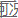
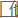

# 飞卢小说网 (Faloo) 分析笔记

创建日期: 2025/11/17

## 一、背景

在飞卢小说网的 Web 端, VIP 章节采用了「服务端将正文渲染为图片后返回」的方案。

在渲染过程中, 页面会对正文图片进行如下处理:

* 在正文内容上叠加用户信息水印
* 在页面中加入网站广告信息
* 对部分正文区域绘制干扰识别的边框

例如, 字符 `吧` 在被添加干扰边框后, 会渲染为:


然而, 该方案有时会出现渲染错位的问题, 导致边框覆盖到文字主体, 从而影响正常阅读, 例如:


---

## 二、方框形态分析

干扰方框在视觉上通常表现为「三边框住的矩形轮廓」, 即只有上边、左边和下边三条边。

其典型特征如下:

* 每个方框大小为 **18 × 18 像素**
* 左侧边框通常为 **2 像素宽**
* 相邻方框在同一行时, 其左侧边框会与前一个方框的右侧区域 **重叠 2 像素**, 从而在整体上形成连续的四边形框效果
* 在每行最右侧, 由于没有后续方框来补齐右边界, 最终视觉效果通常是「一排完整方框 + 1 个三边框住的矩形轮廓」

最右侧方框示例:


最左侧方框示例:


可以看到, 在同为 18 × 18 像素的前提下, 左侧方框的最右侧多出了 2 列与左侧边框同色的像素, 用于与右侧方框重叠。

在某些排版或渲染条件下, 边框可能会「压到」字符笔画内部, 例如:


以及与相邻方框叠加的情况:



另外, 不同行的方框在颜色选取上可能略有差异。

例如, 在上述错位的示例中, 左侧边框的颜色与最开始示例中的边框颜色明显不同; 类似地, 还存在如下对比示例:


以及:



---

## 三、方框识别

结合上述形态特征, 可以将单个方框大致抽象为如下结构:

* 左侧 **2 列像素** (有时会出现 3 列, 其中第 3 列可能用于渲染阴影效果)
* 上边和下边各 **1 行像素** 构成矩形轮廓
* 上侧边框上通常有 **2 个像素宽度的「笔触」**

基于此, 我们可以为该结构构造一个 **18×18 的掩码 (mask)**。

其中值为 `1` 的位置表示边框位置, **在这些位置上若出现纯白像素, 则判定此窗口不是方框**。

即这些像素必须是 **非白** 的 (通常是盒子的线条颜色)。

### 基础实现

假设图片已经读取并转换为 RGB 格式的 `numpy` 数组, 形状为 `(H, W, 3)`, 可以使用滑动窗口直接匹配掩码:

```py
from pathlib import Path

import numpy as np
from numpy.lib.stride_tricks import sliding_window_view
from numpy.typing import NDArray
from PIL import Image

REQUIRED = np.array(
    [
        [0, 0, 0, 0, 0, 0, 0, 0, 0, 0, 0, 0, 0, 0, 1, 1, 0, 0],
        [1, 1, 1, 1, 1, 1, 1, 1, 1, 1, 1, 1, 1, 1, 1, 1, 1, 0],
        [1, 1, 0, 0, 0, 0, 0, 0, 0, 0, 0, 0, 0, 0, 0, 0, 0, 0],
        [1, 1, 0, 0, 0, 0, 0, 0, 0, 0, 0, 0, 0, 0, 0, 0, 0, 0],
        [1, 1, 0, 0, 0, 0, 0, 0, 0, 0, 0, 0, 0, 0, 0, 0, 0, 0],
        [1, 1, 0, 0, 0, 0, 0, 0, 0, 0, 0, 0, 0, 0, 0, 0, 0, 0],
        [1, 1, 0, 0, 0, 0, 0, 0, 0, 0, 0, 0, 0, 0, 0, 0, 0, 0],
        [1, 1, 0, 0, 0, 0, 0, 0, 0, 0, 0, 0, 0, 0, 0, 0, 0, 0],
        [1, 1, 0, 0, 0, 0, 0, 0, 0, 0, 0, 0, 0, 0, 0, 0, 0, 0],
        [1, 1, 0, 0, 0, 0, 0, 0, 0, 0, 0, 0, 0, 0, 0, 0, 0, 0],
        [1, 1, 0, 0, 0, 0, 0, 0, 0, 0, 0, 0, 0, 0, 0, 0, 0, 0],
        [1, 1, 0, 0, 0, 0, 0, 0, 0, 0, 0, 0, 0, 0, 0, 0, 0, 0],
        [1, 1, 0, 0, 0, 0, 0, 0, 0, 0, 0, 0, 0, 0, 0, 0, 0, 0],
        [1, 1, 0, 0, 0, 0, 0, 0, 0, 0, 0, 0, 0, 0, 0, 0, 0, 0],
        [1, 1, 0, 0, 0, 0, 0, 0, 0, 0, 0, 0, 0, 0, 0, 0, 0, 0],
        [1, 1, 0, 0, 0, 0, 0, 0, 0, 0, 0, 0, 0, 0, 0, 0, 0, 0],
        [1, 1, 1, 1, 1, 1, 1, 1, 1, 1, 1, 1, 1, 1, 1, 1, 1, 1],
        [1, 1, 0, 0, 0, 0, 0, 0, 0, 0, 0, 0, 0, 0, 0, 0, 0, 0],
    ],
    dtype=bool,
)

def detect_boxes(img_arr: NDArray[np.uint8]) -> list[tuple[int, int]]:
    """
    Return list of (row, col) where the 18x18 window matches REQUIRED mask.
    """

    # Compute is_white mask: True means pixel is pure white
    is_white = (
        (img_arr[:, :, 0] == 255) &
        (img_arr[:, :, 1] == 255) &
        (img_arr[:, :, 2] == 255)
    )

    # Generate sliding windows over is_white
    windows = sliding_window_view(is_white, (18, 18))

    bad = windows & REQUIRED
    matches = ~bad.any(axis=(2, 3))

    coords = np.argwhere(matches)
    return [tuple(x) for x in coords]
```

该方法可能无法覆盖所有情况, 但在实际测试中, 能够识别出相当大比例的方框位置。

示例 (将所有识别到的 18×18 区域裁剪存盘以便人工检查):

```py
def test() -> None:
    img_path = Path("./sample.gif")
    output_dir = Path("./box_image")
    print(f"Processing {img_path.name}")

    img = Image.open(img_path).convert("RGB")
    arr = np.asarray(img, dtype=np.uint8)

    coords = detect_boxes(arr)

    # cut and save each 18x18 block
    for (r, c) in coords:
        crop = arr[r:r+18, c:c+18, :]   # shape (18, 18, 3)
        out_path = output_dir / f"{img_path.stem}_{r}_{c}.png"
        Image.fromarray(crop).save(out_path)

    print(f"  Found {len(coords)} blocks.")
```

该方法在实际样本中检测效果良好, 但由于 `sliding_window_view` 会构造大量视图, 其性能相对有限。

### 性能优化记录 (Benchmark)

以下是几种尝试过的实现方式, 仅作为调研记录。

测试条件:

* **输入尺寸**：约 945 × 2300 的单张图片
* **每种方法执行 10 次**, 取平均值

**`detect_boxes` (参考版本)**

基于 `sliding_window_view` 的直接实现。

```
min = 0.724 s
max = 0.916 s
mean = 0.777 s
```

**`detect_boxes_v1`**

微调版, 仍依赖 sliding_window, 性能与参考版接近。

```
min = 0.735 s
max = 0.754 s
mean = 0.746 s
```

实现:

```py
def detect_boxes_v1(img_arr: NDArray[np.uint8]) -> list[tuple[int, int]]:
    is_white = (img_arr == 255).all(axis=-1)
    windows = sliding_window_view(is_white, (18, 18))

    bad = windows & REQUIRED
    matches = ~bad.any(axis=(2, 3))

    coords = np.argwhere(matches)
    return [tuple(x) for x in coords]
```

**`detect_boxes_v2`**

尝试将滑动窗口逻辑替换为向量化索引; 仍构造较大的中间数组。

```
min = 0.396 s
max = 0.408 s
mean = 0.403 s
```

比滑窗版本快约 2 倍。

实现:

```py
def detect_boxes_v2(img_arr: NDArray[np.uint8]) -> list[tuple[int, int]]:
    is_white = (img_arr == 255).all(axis=-1)

    req = np.argwhere(REQUIRED)
    ri = req[:, 0]
    rj = req[:, 1]

    H, W = is_white.shape
    out_H = H - 17
    out_W = W - 17

    # Grid for top-left positions
    rows = np.arange(out_H)[:, None, None]
    cols = np.arange(out_W)[None, :, None]

    # Expand offsets
    ri = ri[None, None, :]
    rj = rj[None, None, :]

    # Check all REQUIRED positions
    # True means "white", but REQUIRED must be NON-white
    bad = is_white[rows + ri, cols + rj]  # (out_H, out_W, K)

    matches = ~bad.any(axis=2)

    coords = np.argwhere(matches)
    return [tuple(x) for x in coords]
```

**`detect_boxes_v3`**

将 `REQUIRED` 中所有 "受约束的位置" 预先展开为 `(di, dj)` 偏移量。

检测时, 对每个 chunk (最多 32 个偏移) 逐位检查是否出现白色像素。

因为 `REQUIRED` 中实际 "必须非白" 的位置大约只有几十个, 所以此法相对高效。

```
min = 0.034 s
max = 0.038 s
mean = 0.036 s
```

比参考版快 **约 20 倍**。

实现:

```py
# === precompute REQUIRED data ===
req_coords = np.argwhere(REQUIRED)    # shape: (K, 2)
di_all = req_coords[:, 0]
dj_all = req_coords[:, 1]
K = di_all.shape[0]

CHUNK_SIZE = 32
REQ_CHUNKS = [
    (di_all[i:i+CHUNK_SIZE], dj_all[i:i+CHUNK_SIZE])
    for i in range(0, K, CHUNK_SIZE)
]

def detect_boxes_v3(img_arr: NDArray[np.uint8]) -> list[tuple[int, int]]:
    is_white = (img_arr == 255).all(axis=-1)

    H, W = is_white.shape
    out_H = H - 17
    out_W = W - 17

    matches = np.ones((out_H, out_W), dtype=bool)

    # For each packed chunk
    for (di_list, dj_list) in REQ_CHUNKS:
        # For this chunk, compute if ANY required pixel is white
        # Initialize to False (no bad pixels yet)
        bad = np.zeros((out_H, out_W), dtype=bool)

        # OR accumulate across this chunk's bits
        for di, dj in zip(di_list, dj_list):
            bad |= is_white[di:di+out_H, dj:dj+out_W]

        # A match requires: no required-bit is white
        matches &= ~bad

    coords = np.argwhere(matches)
    return [tuple(x) for x in coords]
```

---

## 四、方框去除思路

一种最直接的方式是将方框区域「填白」: 即用纯白像素覆盖对应位置。该方法在部分场景下可以去除约一半以上的干扰情况。

但在以下情形中效果较差:

* 字体笔画刚好与方框区域重叠
* 文本渲染存在一定程度的错位或抖动
* 字形本身较大或存在粗体、描边等效果

在这些情况下, 简单填白会破坏文字结构, 使后续 OCR 或人工阅读变得困难。

示例:

```py
def clean_box_18x18(arr: NDArray[np.uint8]) -> NDArray[np.uint8]:
    """Simple brute-force version: fill all detected 18x18 boxes with white."""
    cleaned = arr.copy()
    coords = detect_boxes(arr)
    for r, c in coords:
        cleaned[r:r+18, c:c+18][REQUIRED] = 255
    return cleaned

def main() -> None:
    img_path = Path("./sample_8.png")
    out_path = Path("./sample_8_cleaned.png")

    img = Image.open(img_path).convert("RGB")
    img_arr = np.asarray(img, dtype=np.uint8)

    cleaned = clean_box_18x18(img_arr)

    Image.fromarray(cleaned).save(out_path)
    print(f"Saved to {out_path}")
```

原图:


处理后:


可以看到:

* 第一个 `不` 字的竖笔画被削去一半
* 第二个 `由` 字的竖线甚至完全消失

这也是直接填白方案最大的局限: 只要方框像素落在笔画上, 就必然造成文字损伤。

因此, 可以考虑另一类方法: 尝试利用像素的混色特征, 对受干扰区域进行 **颜色反推** (inverse blending)。

若能建立背景颜色、方框颜色与文字渲染之间的关系, 就有机会近似还原被覆盖前的内容。

### 字体渲染与混色

在常见的文本渲染中, 字体与背景之间的融合依赖抗锯齿 (AA) 或次像素渲染所生成的透明度覆盖率 (coverage), 每个像素的颜色通常由字体颜色与背景颜色按一定比例混合得到。

为方便描述, 此处使用如下的**示例性模型** (实际渲染流程会因平台、引擎、色彩空间等因素而有所不同):

$C_{\text{out},c} = C_{\text{dst},c} + \text{coverage}_{c} \cdot (C_{\text{src},c} - C_{\text{dst},c})$

其中

* $C_{\text{src}}$: 字体颜色
* $C_{\text{dst}}$: 背景颜色
* coverage: 0 ~ 1 的混合比例 (由字形边缘的灰度或次像素权重决定)
* $c \in \{R, G, B\}$, 在次像素渲染中三个通道的 coverage 可能不同

coverage 越高, 像素越接近字体颜色; 越低, 则输出颜色越接近背景颜色。

并且实际渲染可能包括预乘 Alpha、Gamma 空间混合、子像素过滤等更多细节, 因此真实过程不一定完全符合此公式。

理论上, 只要能够合理估计字体颜色、背景颜色及 coverage 的取值范围, 就有可能对方框覆盖区域进行一定程度的逆向推算或重建。

但这会显著增加实现复杂度, 且对参数敏感, 目前阶段暂不打算深入实现, 仅作为后续可能的优化方向记录。

---

以上内容主要是对飞卢小说网 VIP 章节渲染干扰方框的一些观察、尝试和思路记录。

如有更优的检测/去除方案或改进建议, 欢迎在 ISSUE 中提出交流。
